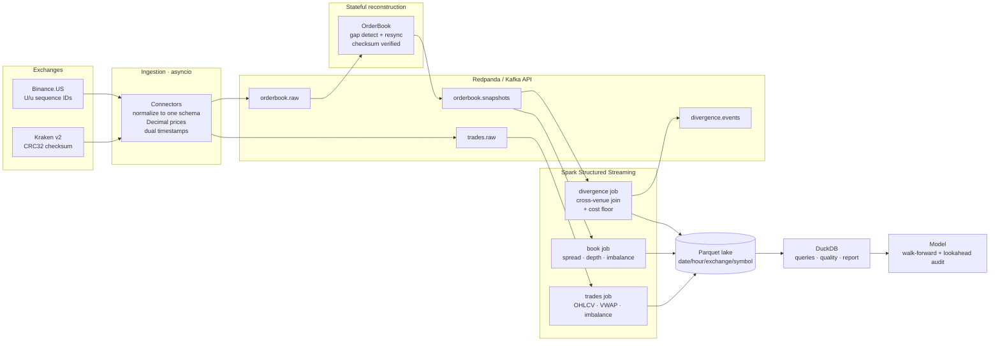

# xstream

A real-time streaming pipeline that ingests L2 order book and trade data from
two crypto exchanges simultaneously, reconstructs live order books, computes
microstructure features, and detects cross-exchange price divergences — with a
deliberately self-skeptical evaluation layer.

**This is streaming data infrastructure and feature engineering. It is not a
trading bot.** The prediction task exists to demonstrate evaluation rigor, not
to claim anything here is profitable. The honest conclusion about
cross-exchange divergence — worked out in arithmetic, not vibes — is that
essentially none of it is exploitable after costs.

> **Status:** all nine milestones implemented; **159 tests pass**. Two data
> gaps mean parts of the pipeline run correctly while producing empty output.
> Those gaps are documented rather than papered over — see
> [Honest limitations](#honest-limitations) and [`RUNBOOK.md`](RUNBOOK.md) for
> exactly what is needed to get real numbers flowing.

---

## Architecture



Two design choices are worth pulling out of that diagram.

**Reconstruction sits in front of Spark, not inside it.** Both venues send only
*changed* levels, so top-of-book is only knowable from reconstructed state. The
first version computed spread in Spark from raw deltas and was wrong by a
factor of 1,750 (D-017).

**The two venues verify integrity differently** — Kraken by checksum, Binance
by sequence number — so the book layer abstracts over both rather than
pretending they are the same thing (D-004).

---

## Quickstart

```bash
uv sync
docker compose up -d              # Redpanda + Console
./scripts/create_topics.sh

# ingestion, one process per venue
uv run python -m xstream.ingest --exchange kraken     --brokers localhost:19092
uv run python -m xstream.ingest --exchange binance_us --brokers localhost:19092

# stateful reconstruction, then Spark
uv run python -m xstream.orderbook.snapshotter   --brokers localhost:19092
uv run python -m xstream.processing.trades_job   --brokers localhost:19092
uv run python -m xstream.processing.book_job     --brokers localhost:19092
uv run python -m xstream.processing.divergence_job --brokers localhost:19092

# analytics
uv run python -m xstream.analysis.report          # inventory + quality + 9 queries
uv run streamlit run dashboard/app.py             # dashboard on :8501
```

No exchange access? The captured fixtures replay through the identical
connector, normalizer and sink:

```bash
uv run python -m xstream.ingest.replay --brokers localhost:19092
```

Redpanda is not required — anything speaking the Kafka protocol works. This
project's own verification ran against Apache Kafka in KRaft mode.

---

## Design decisions

Full log in [`DECISIONS.md`](DECISIONS.md) (31 entries). The ones that shaped
the most code:

| | |
| --- | --- |
| **Why Redpanda** | Single binary, no ZooKeeper/KRaft ceremony, starts in seconds — keeps the five-minute quickstart honest. Protocol-identical to Kafka, so migration is a broker address change (D-007). |
| **Why these two venues** | Chosen on evidence, not the original plan. Coinbase's L2 feed carries **no sequence number and no checksum**, so a dropped update cannot be detected at all — which would have gutted Milestone 2 (D-004, D-005). |
| **Partition by symbol** | Preserves per-venue ordering and gives the cross-exchange join partition locality, at the cost of deliberate skew: 73.1% of messages land in one partition (D-008, D-029). |
| **Decimal, not float** | Kraken sends prices as JSON *numbers*; `json.loads` destroys precision before application code sees it. Books key on exact price equality, so a float one ULP off is a different level (D-003). |
| **Watermark = 10s** | A watermark is a decision about how wrong you are willing to be. Event-time windowing keeps lateness and clock skew measurable instead of hiding them (D-015). |
| **At-least-once** | Duplicates are detectable from venue sequence numbers and trade IDs; dropped messages are not. Exactly-once was not worth its cost (D-009). |
| **Stop on integrity loss** | A book that keeps serving after detected corruption feeds plausible wrong numbers to everything downstream (D-013). |

### Three bugs the design caught

Worth reading in full, because each one nearly shipped:

1. **VWAP outside its own high–low range** (D-023). Spark caps decimal
   precision at 38 digits and sacrifices *scale* to stay there, silently
   rescaling `DECIMAL(38,18)` products to 6 decimals — turning a quantity of
   `0.00009417` into `0.000094`. Every unit test passed. Only an *invariant*
   check found it.
2. **An outlier detector that could not fire** (D-026). A z-score threshold of
   6σ is unreachable at n=31, because an outlier inflates the standard
   deviation it is judged against. Then the MAD replacement collapsed to zero
   on a near-constant series. Both fixed.
3. **A lookahead audit that could not fire** (D-031). It perturbed rows that
   `build_features` drops, so the corruption never reached the output and it
   reported "clean" for a deliberately planted leak.

The pattern: *a detector that cannot fire is worse than none, because it reads
as reassurance.*

---

## Benchmarks

Full numbers in [`BENCHMARKS.md`](BENCHMARKS.md).

| | |
| --- | --- |
| **Bottleneck** | Book reconstruction with checksum verification, **~34,000 deltas/s** |
| Producer ceiling | 579,260 msg/s |
| Consumer drain | 44,045 msg/s |
| Cost of `Decimal` correctness | **1.62x** slower parsing |
| Cost of checksum correctness | **8.4x** slower book updates |
| Latency percentiles | **not measured** — replay makes them meaningless |

The pipeline is **CPU-bound in its stateful stage, not I/O-bound at the
broker**: the broker sustains ~17x the pipeline's own ceiling, so adding
brokers buys nothing until books are sharded by `(exchange, symbol)`.

Checksum verification is 88% of the bottleneck stage and stays on regardless —
34k deltas/s is still ~1,500x the fixture's real-time rate, and an unverified
book is the failure the whole design exists to prevent.

**Induced failures.** Backpressure never fires at default settings, then
collapses throughput **625x** (579,260 → 926 msg/s) when the queue is
undersized — with nothing logged, so the symptom looks nothing like the cause.

---

## Cross-exchange divergence, and why it is not an opportunity

Every joined row carries `net_edge_bps`: gross divergence minus two taker fees
minus the half-spread crossed on each venue. Using published retail fees and
the spreads this pipeline measured:

```
26 bps (Kraken) + 40 bps (Binance.US) + 0.5 × (0.02 + 0.14) = 66.08 bps
```

**A divergence must exceed ~66 bps before a naive round trip breaks even.**
Typical liquid-pair divergences are a few bps — an order of magnitude short, so
a factor-of-two error in the fee assumptions changes nothing.

And `survives_costs = true` is far weaker than it sounds: it means only that
the most *favourable* accounting has not ruled a divergence out. Latency, queue
position, inventory pre-positioning, displayed size and adverse selection all
subtract further and none is modelled — enumerated in
`xstream.analysis.economics.EXPLOITABILITY_CAVEATS` so the omissions are
explicit rather than implied.

---

## Evaluation

See [`EVALUATION.md`](EVALUATION.md). The harness refuses to report metrics
below 500 usable rows, and on the current lake it refuses — one usable row.

It is validated against synthetic data where the answer is known:

| scenario | mean lift | verdict |
| --- | ---: | --- |
| Random walk | **−0.0394** | NO SIGNAL (model loses to always-down) |
| Planted signal | **+0.3800** | SIGNAL DETECTED |

A harness that only ever says "no signal" is indistinguishable from a broken
one, so it has to be shown capable of finding signal that is genuinely there.

---

## What I would change at production scale

**Managed Kafka and partition scaling.** Redpanda-in-Docker is a development
convenience. Production wants MSK or Confluent Cloud for multi-AZ replication
and someone else's pager. Because the choice was made on the *protocol*, that
migration is a broker address change. Partition count is the harder problem: it
cannot be reduced, and increasing it remaps keys and breaks per-key ordering,
so it must be sized for the symbol count you expect rather than the one you
have. Today 4 of 6 partitions sit empty (D-029).

**Exactly-once vs at-least-once.** This pipeline is deliberately at-least-once
(D-009), because market data carries its own dedup keys — venue sequence
numbers and trade IDs — so duplicates are detectable downstream while dropped
messages are not recoverable. At production scale I would keep that choice and
make the dedup explicit: idempotent book application (already true) and
aggregation keyed on `(exchange, symbol, trade_id)`.

**Handling skew.** The symbol-keyed partitioning that gives the divergence join
its locality also caps consumer-group parallelism at the number of symbols with
traffic. With two symbols that ceiling is 2 consumers, ~88k msg/s. More symbols
spreads keys naturally and costs nothing; a composite `(exchange, symbol)` key
doubles parallelism but splits the join. That is the trade to revisit first,
and only when symbol count alone is not enough.

**Schema registry.** Messages are JSON with schemas defined in Python
dataclasses. That is fine for one producer and one consumer team, and it is not
fine at scale: nothing prevents a producer change from silently breaking a
consumer. Avro or Protobuf behind a schema registry, with compatibility
enforced at publish time, replaces the `schema_drift` data-quality check with a
guarantee. JSON also costs bandwidth — 7.9 µs/message just to encode.

**Cost.** The dominant costs would be broker storage and Spark compute, both
driven by retention and window granularity. 1-second candles across many
symbols is a lot of rows for questions usually asked at minute resolution; I
would keep 1s only for a short retention window and roll up beyond it. The
small-file problem is a real cost multiplier too — compaction cut this lake
80.8% (D-025), and object-store request pricing punishes many small files
harder than local disk does.

**Monitoring and alerting.** The counters exist (`gap_count`,
`checksum_failures`, reconnects, consumer lag) but nothing consumes them.
Production needs them on a dashboard with alerts on: consumer lag trending up,
any non-zero checksum failure rate, a book stuck STALE, ingest latency p99
crossing the watermark (because that is when data starts being dropped rather
than merely late), and Spark batch duration exceeding the trigger interval.
The backpressure cliff (D-028) argues specifically for alerting on producer
queue depth, since its symptom is silent.

**Backfill.** Reprocessing from `earliest` works today because retention is
short and volume is tiny. At scale, backfill needs to be a separate job writing
to a separate output path, then an atomic swap — not a rerun of the streaming
job with a wiped checkpoint, which competes with live processing for the same
partitions. Event-time partitioning already makes a bounded backfill possible:
a re-run for one day touches one day's directories.

---

## Honest limitations

**What does not work yet, and why:**

- **Binance books are never seeded.** The `@depth` stream is diffs only;
  seeding needs a REST snapshot from `/api/v3/depth`, which was unreachable
  from the development environment. That path was deliberately *not* written
  against a guessed schema (D-012).
- **Divergence output is empty.** Two independent causes: only one venue
  produces book state, and the two venues traded different symbols in the
  capture. The job is correct; it has one side of a two-sided join (D-021).
- **No latency measurements.** On replayed fixtures the venue-to-ingest gap is
  the *age of the capture* — the pipeline reported a p50 of about nine days.
  Arithmetically correct, analytically worthless (D-024, D-030).
- **No real prediction result.** One usable feature row (D-021, EVALUATION.md).
- **The fixture is 40 seconds of quiet market.** Enough for correctness — it
  drove 474 checksum verifications — and nowhere near enough for claims about
  market behaviour, volatility regimes, or load beyond a single burst.
- **No demo GIF.** Requires a live pipeline and screen capture, neither
  available in the environment this was built in.

**What would break at 100x:** the book stage first, at ~34k deltas/s per
process, because it is single-threaded and sequential per instrument. Then
consumer parallelism, capped by partition skew. The broker itself is not close.
Memory and GC behaviour are entirely unexercised — the fixture is too small to
have pressured them.

See [`RUNBOOK.md`](RUNBOOK.md) for the concrete steps to close these gaps.

---

## Repository layout

```
scripts/recon/          per-exchange connectivity probes
src/xstream/ingest/     connectors, normalization, producer, runner, replay
src/xstream/orderbook/  stateful reconstruction, gap detection, snapshotter
src/xstream/processing/ Spark jobs: trades, book features, divergence
src/xstream/analysis/   DuckDB layer, compaction, quality checks, cost model
src/xstream/bench/      per-stage throughput, load test, consumer lag
src/xstream/model/      features + evaluation harness
dashboard/app.py        Streamlit dashboard
queries/                9 analytical SQL queries
docs/SCHEMAS.md         real venue message schemas, from captured data
docs/samples/           captured raw frames used as test fixtures
DECISIONS.md            31 design decisions and tradeoffs
BENCHMARKS.md           measured throughput and failure modes
EVALUATION.md           prediction task and evaluation rigor
RUNBOOK.md              what is needed to get this running for real
```
